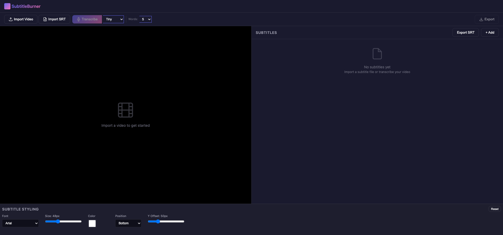

# SubtitleBurner

Desktop application for burning subtitles into videos with an intuitive editor and Whisper transcription.



## Features

- **Video Import** - Support for common video formats (MP4, MKV, AVI, MOV)
- **Subtitle Editing** - Add, edit, delete, and import/export SRT files
- **Subtitle Styling** - Customize font, size, color, position, and background
- **Whisper Transcription** - Automatic speech-to-text using OpenAI's Whisper model
- **Export** - Burn subtitles into video using ASS format

## Downloads

Download the latest release from [GitHub Releases](https://github.com/anomalyco/subtitle-burner/releases).

## Development

### Prerequisites

- [Rust](https://rustup.rs/)
- [Node.js](https://nodejs.org/)
- [FFmpeg](https://ffmpeg.org/) (required for video processing)

### Setup

```bash
npm install
```

### Development

```bash
npm run tauri dev
```

### Build

```bash
npm run tauri build
```

## Requirements

- **Windows**: FFmpeg must be installed and in PATH
  - Via winget: `winget install ffmpeg`
  - Via Chocolatey: `choco install ffmpeg`

- **macOS**: FFmpeg usually available via Homebrew
  - `brew install ffmpeg`

- **Linux**: FFmpeg typically available via package manager
  - `sudo apt install ffmpeg` (Ubuntu/Debian)
  - `sudo dnf install ffmpeg` (Fedora)

## Tech Stack

- [Tauri](https://tauri.app/) - Desktop framework
- [React](https://react.dev/) - UI framework
- [Rust](https://www.rust-lang.org/) - Backend
- [Whisper](https://github.com/openai/whisper) - Speech recognition
